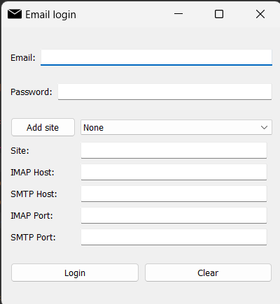
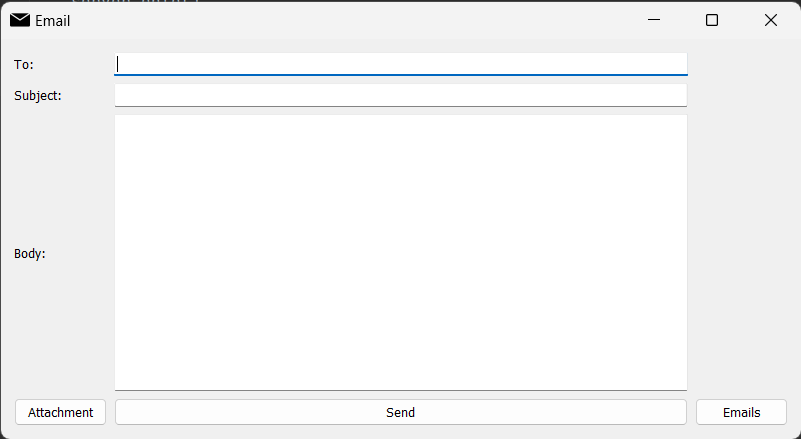
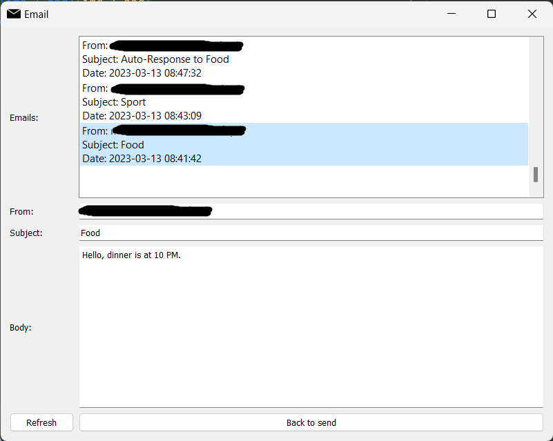

# Email app

  
This mail application was written in Python and allows you to log to your email, send and read them.  
In json file there are the most popular sites like gmail, interia or onet, but you can add more.  

